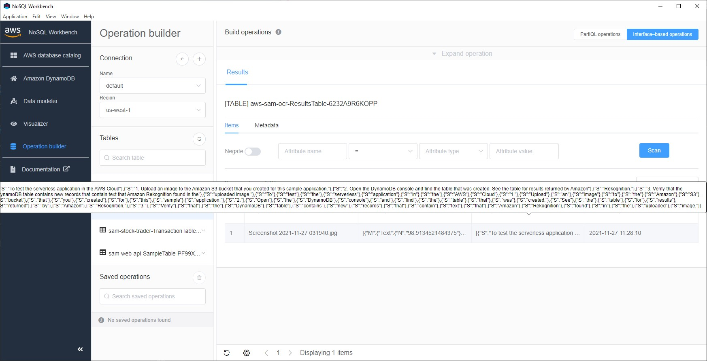

# aws-sam-ocr
* [Tutorial](https://docs.aws.amazon.com/serverless-application-model/latest/developerguide/serverless-example-s3.html)

## 1. Setup
```sh
$ sam init --location https://github.com/aws-samples/cookiecutter-aws-sam-s3-rekognition-dynamodb-python --no-input

$ cd aws_sam_ocr

$ sam package --template-file template.yaml --output-template-file packaged.yaml --s3-bucket sam.hello
Uploading to a3cbd032d1a0b4737e24efdd80c741f5  5617 / 5617  (100.00%)

Successfully packaged artifacts and wrote output template to file packaged.yaml.
Execute the following command to deploy the packaged template
sam deploy --template-file E:\workspace_sam\aws_sam_ocr\packaged.yaml --stack-name <YOUR STACK NAME>


$ sam deploy --template-file packaged.yaml --stack-name aws-sam-ocr --capabilities CAPABILITY_IAM --region us-west-1

        Deploying with following values
        ===============================
        Stack name                   : aws-sam-ocr
        Region                       : us-west-1
        Confirm changeset            : False
        Disable rollback             : False
        Deployment s3 bucket         : None
        Capabilities                 : ["CAPABILITY_IAM"]
        Parameter overrides          : {}
        Signing Profiles             : {}

Initiating deployment
=====================

Waiting for changeset to be created..

CloudFormation stack changeset
-------------------------------------------------------------------------------------------------------------------------
Operation                      LogicalResourceId              ResourceType                   Replacement
-------------------------------------------------------------------------------------------------------------------------
+ Add                          DetectTextInImageBucketEvent   AWS::Lambda::Permission        N/A
                               1Permission
+ Add                          DetectTextInImageRole          AWS::IAM::Role                 N/A
+ Add                          DetectTextInImage              AWS::Lambda::Function          N/A
+ Add                          ResultsTable                   AWS::DynamoDB::Table           N/A
+ Add                          SourceImageBucket              AWS::S3::Bucket                N/A
-------------------------------------------------------------------------------------------------------------------------

Changeset created successfully. arn:aws:cloudformation:us-west-1:450837389776:changeSet/samcli-deploy1638011305/c117ec6a-0dd9-429a-bfe3-59fdf6e786ea


2021-11-27 03:08:36 - Waiting for stack create/update to complete

CloudFormation events from stack operations
-------------------------------------------------------------------------------------------------------------------------
ResourceStatus                 ResourceType                   LogicalResourceId              ResourceStatusReason
-------------------------------------------------------------------------------------------------------------------------
CREATE_IN_PROGRESS             AWS::DynamoDB::Table           ResultsTable                   Resource creation Initiated
CREATE_IN_PROGRESS             AWS::DynamoDB::Table           ResultsTable                   -
CREATE_COMPLETE                AWS::DynamoDB::Table           ResultsTable                   -
CREATE_IN_PROGRESS             AWS::IAM::Role                 DetectTextInImageRole          -
CREATE_IN_PROGRESS             AWS::IAM::Role                 DetectTextInImageRole          Resource creation Initiated
CREATE_COMPLETE                AWS::IAM::Role                 DetectTextInImageRole          -
CREATE_IN_PROGRESS             AWS::Lambda::Function          DetectTextInImage              -
CREATE_IN_PROGRESS             AWS::Lambda::Function          DetectTextInImage              Resource creation Initiated
CREATE_COMPLETE                AWS::Lambda::Function          DetectTextInImage              -
CREATE_IN_PROGRESS             AWS::Lambda::Permission        DetectTextInImageBucketEvent   -
                                                              1Permission
CREATE_IN_PROGRESS             AWS::Lambda::Permission        DetectTextInImageBucketEvent   Resource creation Initiated
                                                              1Permission
CREATE_COMPLETE                AWS::Lambda::Permission        DetectTextInImageBucketEvent   -
                                                              1Permission
CREATE_IN_PROGRESS             AWS::S3::Bucket                SourceImageBucket              -
CREATE_IN_PROGRESS             AWS::S3::Bucket                SourceImageBucket              Resource creation Initiated
CREATE_COMPLETE                AWS::S3::Bucket                SourceImageBucket              -
CREATE_COMPLETE                AWS::CloudFormation::Stack     aws-sam-ocr                    -
-------------------------------------------------------------------------------------------------------------------------

Successfully created/updated stack - aws-sam-ocr in us-west-1

```

## 2. Test Locally
```sh
$ TABLE_NAME=aws-sam-ocr-ResultsTable-6232A9R6KOPP sam.cmd local invoke --event SampleEvent.json
Invoking src/app.lambda_handler (python3.6)
Image was not found.
Removing rapid images for repo public.ecr.aws/sam/emulation-python3.6
Building image..............................................................................................
Skip pulling image and use local one: public.ecr.aws/sam/emulation-python3.6:rapid-1.35.0-x86_64.

Mounting E:\workspace_sam\aws_sam_ocr as /var/task:ro,delegated inside runtime container
START RequestId: 2e36b594-5793-4c98-95b6-039210e7e368 Version: $LATEST
END RequestId: 2e36b594-5793-4c98-95b6-039210e7e368
REPORT RequestId: 2e36b594-5793-4c98-95b6-039210e7e368  Init Duration: 0.09 ms  Duration: 2298.07 ms    Billed Duration: 2299 ms        Memory Size: 512 MB Max Memory Used: 512 MB
"Success"
```

Test Image:


Result:
